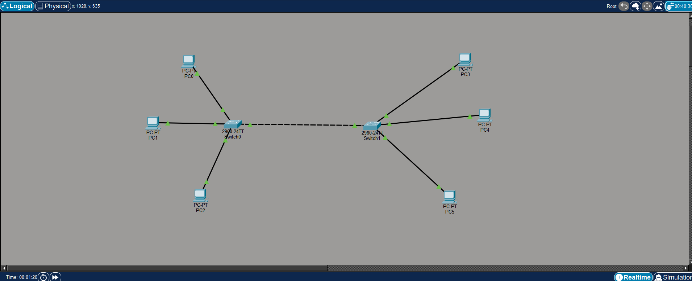

# Lab03 - Exercise 01: MAC Addresses and ARP

## Objective

* Create a simple local area network (LAN) using multiple switches and PCs.
* Understand the role of MAC addresses in Layer 2 switching.
* Analyze how a switch dynamically builds its MAC Address Table.
* Observe and understand the Address Resolution Protocol (ARP) broadcast process.

---

## Topology

### 2 Switches and 6 PCs Network

       PC0                 PC3
         \                 /
PC1 ---- Switch0 ==== Switch1 ---- PC4
         /                 \
       PC2                 PC5

*(Connections: PCs to Switches using Straight-Through cables. Switch0 to Switch1 using a Cross-Over cable.)*

---

## IP Configuration

*All PCs are configured within the same network (192.168.1.0/24)*

* **PC0:** 192.168.1.1 / 255.255.255.0
* **PC1:** 192.168.1.2 / 255.255.255.0
* **PC2:** 192.168.1.3 / 255.255.255.0
* **PC3:** 192.168.1.4 / 255.255.255.0
* **PC4:** 192.168.1.5 / 255.255.255.0
* **PC5:** 192.168.1.6 / 255.255.255.0

---

## Steps

### Part 1: Set Up the Network
1. Place 2 Switches and 6 PCs in the workspace.
2. Connect PCs to switches and the two switches together using appropriate cables.
3. Assign static IP addresses to all 6 PCs.

### Part 2: Packet Simulation and Analysis
1. Open Simulation Mode in Packet Tracer.
2. Initiate a ping from one PC to another (e.g., PC1 to PC5).
3. Observe the initial ARP Broadcast packet (flooded to all ports) followed by the ICMP Unicast packet.

### Part 3: Table Verification
1. Open the Switch CLI and check the MAC address table: `show mac-address-table`
2. Open the Switch CLI and check the ARP table: `show arp`
3. Open a PC Command Prompt and check its ARP cache: `arp -a`

---

## Testing & Verification

* **Ping Test:** `ping 192.168.1.6` (From PC1 to PC5) - Successful.
* **Switch MAC Table:** Successfully verified that the switch dynamically learns the MAC addresses of connected devices and associates them with specific ports (e.g., Fa0/1, Gig0/1).
* **PC ARP Table:** Successfully verified that the PC maps the destination IP address to its physical MAC address after an ARP request.

---

## Key Learning

* **ARP (Address Resolution Protocol):** Used to discover the MAC address associated with a known IP address.
* **Broadcasts:** ARP requests are broadcasted to everyone on the network, but only the device with the matching IP replies.
* **MAC Address Table:** Switches operate at Layer 2 and use MAC addresses (not IP addresses) to forward frames to the correct destination port.
* **Dynamic Learning:** Switches automatically learn MAC addresses by inspecting the Source MAC address of incoming frames.

---