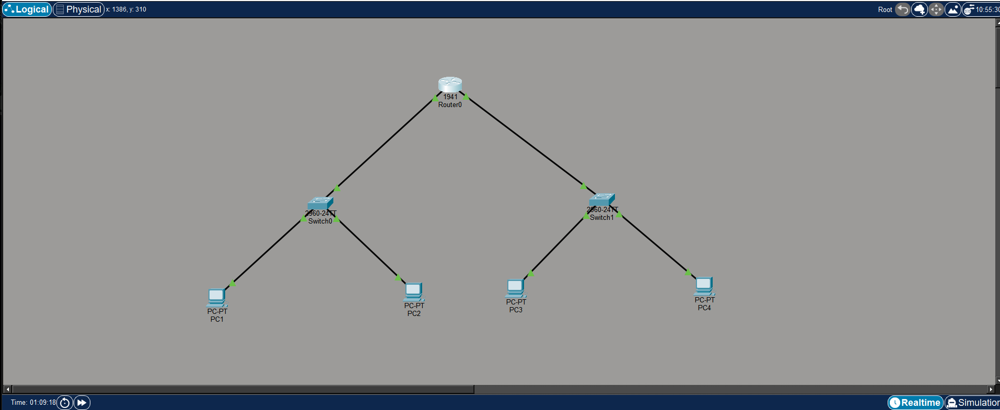

# Lab03 - Exercise 02: Router Configuration and Inter-Network Routing

## Objective

* Configure a router to connect two distinct local area networks (LANs).
* Assign IP addresses to router interfaces and enable them.
* Understand and configure Default Gateways on end devices (PCs).
* Verify connectivity between different networks using ICMP (Ping).
* Perform basic router administrative configurations.

---

## Topology

### 1 Router, 2 Switches, and 4 PCs Network

             Router0
            /       \
           /         \
      Switch0       Switch1
      /     \       /     \
    PC1     PC2   PC3     PC4

*(Connections: Router to Switches using GigabitEthernet ports. PCs to Switches using FastEthernet ports.)*

---

## IP Configuration

*PCs are distributed across two different networks. Default Gateways point to the respective Router interfaces.*

**Network 1 (192.168.1.0/24)**
* **Router0 (G0/0/0):** 192.168.1.1 / 255.255.255.0
* **PC-1:** 192.168.1.3 / 255.255.255.0 (Default Gateway: 192.168.1.1)
* **PC-2:** 192.168.1.4 / 255.255.255.0 (Default Gateway: 192.168.1.1)

**Network 2 (192.168.2.0/24)**
* **Router0 (G0/0/1):** 192.168.2.1 / 255.255.255.0
* **PC-3:** 192.168.2.3 / 255.255.255.0 (Default Gateway: 192.168.2.1)
* **PC-4:** 192.168.2.4 / 255.255.255.0 (Default Gateway: 192.168.2.1)

---

## Steps

### Part 1: Basic Router Configuration
1. Open Router CLI and enter Global Configuration Mode.
2. Set Hostname, disable domain lookup, and configure passwords (console & secret).
3. Encrypt passwords and configure a banner message (`#Authorized Access Only!#`).

### Part 2: Interface IP Configuration
1. Enter `interface g0/0/0`, assign IP `192.168.1.1 255.255.255.0`, and enable it using `no shutdown`.
2. Enter `interface g0/0/1`, assign IP `192.168.2.1 255.255.255.0`, and enable it using `no shutdown`.

### Part 3: Saving Configuration
1. Return to Privileged EXEC mode and execute `copy running-config startup-config` to save the configurations to NVRAM.

### Part 4: PC Configuration
1. Open each PC's IP Configuration.
2. Assign the static IP and Subnet Mask.
3. Crucially, assign the **Default Gateway** corresponding to their respective network's router interface IP.

---

## Testing & Verification

* **Router Interface Verification:** Used `show ip interface brief` on the router to verify that `GigabitEthernet0/0` and `GigabitEthernet0/1` are assigned the correct IPs and their status is `up`.
* **Inter-Network Ping Test:** `ping 192.168.2.4` (From PC-1 to PC-4) - Successful. *(Note: The first packet timed out due to the initial ARP request process across the networks, but subsequent replies were successful).*

---

## Key Learning

* **Default Gateway:** A critical component for a device to communicate outside its own local network. It acts as the "door" out of the network, pointing to the local router interface.
* **Router's Role:** Routers connect disparate networks and forward data packets between them based on routing tables and IP addresses.
* **Interface State:** Unlike switches, router interfaces are disabled (`shutdown`) by default for security and must be explicitly enabled using the `no shutdown` command.

---