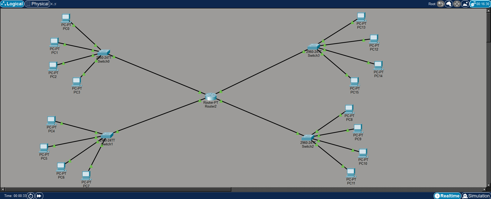

# Lab 04: Network Devices Configuration Practice

## Objective

* Design a multi-network topology connecting 4 distinct LANs using a central router.
* Assign IP addresses to 16 end devices and configure their Default Gateways.
* Perform basic device management configurations on both the Router and Switches.
* Secure network devices by implementing Console, VTY (Remote Access), and Privileged EXEC passwords.
* Enhance network security by encrypting all plaintext passwords and setting Warning Banners.
* Verify end-to-end connectivity across all 4 different networks using ICMP (Ping).

---

## Topology

### 1 Router, 4 Switches, and 16 PCs Network

                 Router1 (R1)
               /   /      \   \
             /    /        \    \
           /     /          \     \
         S1     S2          S3     S4
         |      |           |      |
      PCs 0-3  PCs 4-7   PCs 8-11  PCs 12-15

*(Connections: Router to Switches using GigabitEthernet ports. PCs to Switches using FastEthernet ports.)*

---

## IP Configuration

*The network is divided into four distinct subnets. Default Gateways point to the respective Router interfaces.*

**Network 1 (10.1.10.0/24) - Switch 1**
* **R1 (G0/0/0):** 10.1.10.1 / 255.255.255.0
* **PC0 to PC3:** 10.1.10.10 - 10.1.10.13 / 255.255.255.0 (Default Gateway: 10.1.10.1)

**Network 2 (10.1.20.0/24) - Switch 2**
* **R1 (G0/0/1):** 10.1.20.1 / 255.255.255.0
* **PC4 to PC7:** 10.1.20.10 - 10.1.20.13 / 255.255.255.0 (Default Gateway: 10.1.20.1)

**Network 3 (172.6.10.0/24) - Switch 3**
* **R1 (G0/1/0):** 172.6.10.1 / 255.255.255.0
* **PC8 to PC11:** 172.6.10.10 - 172.6.10.13 / 255.255.255.0 (Default Gateway: 172.6.10.1)

**Network 4 (172.6.20.0/24) - Switch 4**
* **R1 (G0/1/1):** 172.6.20.1 / 255.255.255.0
* **PC12 to PC15:** 172.6.20.10 - 172.6.20.13 / 255.255.255.0 (Default Gateway: 172.6.20.1)

---

## Steps

### Part 1: Basic Router & Switch Configurations
*(These steps were performed on the Router and all 4 Switches via CLI)*
1. Set Hostname (`hostname [Name]`) and disable DNS lookup (`no ip domain-lookup`).
2. Configure console line password (`cisco`) and login.
3. Configure **VTY lines (0 4)** password (`cisco`) for remote access and login.
4. Set Privileged EXEC mode password (`enable secret class`).
5. Encrypt all plaintext passwords globally using `service password-encryption`.
6. Configure a MOTD banner message (`# Authorized Access Only! #`).

### Part 2: Router Interface IP Configuration
1. Enter `interface g0/0/0`, assign IP `10.1.10.1 255.255.255.0`, and enable it (`no shutdown`).
2. Repeat the process for interfaces `g0/0/1`, `g0/1/0`, and `g0/1/1` using their respective gateway IP addresses from the table above.

### Part 3: Saving Configuration
1. Return to Privileged EXEC mode on all devices and execute `copy running-config startup-config` to save the configurations to NVRAM.

### Part 4: PC Configuration
1. Open each PC's IP Configuration.
2. Assign the static IP and Subnet Mask.
3. Assign the correct **Default Gateway** corresponding to their specific subnet's router interface IP.

---

## Testing & Verification

* **Configuration Verification:** Used `show running-config` on devices to verify that VTY passwords were set and all passwords were successfully encrypted as hashes.
* **Router Interface Verification:** Used `show ip interface brief` on the router to verify that all 4 GigabitEthernet interfaces were assigned the correct IPs and their status is `up`.
* **Inter-Network Ping Test:** Successfully pinged PCs across different networks (e.g., from PC0 in Network 1 to PC15 in Network 4). 
* **ARP Verification:** Used `show arp` on the router and `arp -a` on PCs to view the dynamically built ARP cache.

---

## Key Learning

* **VTY Passwords:** Virtual Teletype (VTY) lines require passwords to secure remote management access (like Telnet or SSH) over the network.
* **Password Encryption:** The `service password-encryption` command is crucial for security as it scrambles plaintext passwords in the running configuration file.
* **ARP Cache Behavior:** The initial `Request timed out` during a cross-network ping is due to the ARP broadcast process. Once the MAC address is learned and cached, subsequent packets flow without interruption.

---