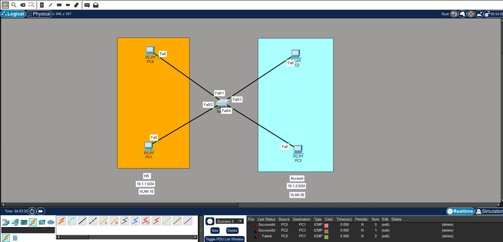
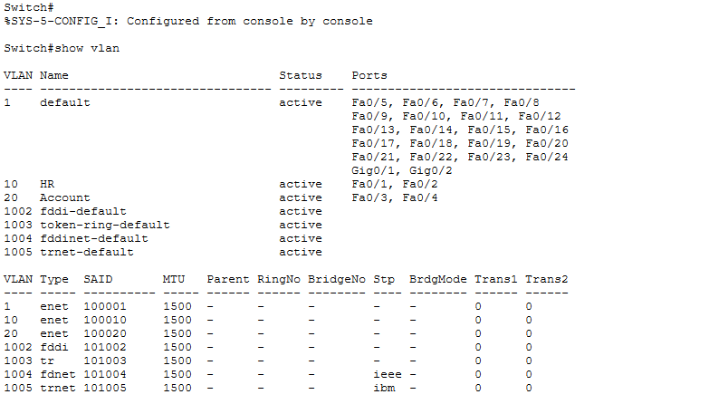
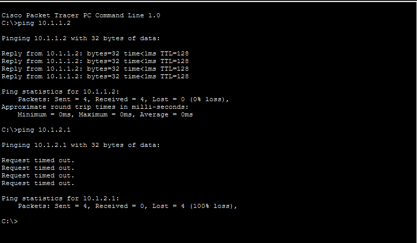

# Cisco Packet Tracer VLAN Segmentation Lab

## Overview

This project demonstrates VLAN segmentation using a Cisco switch in Cisco Packet Tracer.

Two departments were separated into different VLANs:

- HR Department → VLAN 10
- Account Department → VLAN 20

Devices inside the same VLAN can communicate successfully, while communication between different VLANs fails because inter-VLAN routing is not configured.

---

## Topology



---

## Folder Structure

```text
VLAN-Segmentation/
├── README.md
├── VLAN.pkt
├── configs/
│   └── switch-config.txt
└── screenshots/
    ├── ping-test.png
    ├── show-vlan.png
    └── topology.png
```

---

## VLAN Design

| VLAN ID | VLAN Name | Ports |
|---|---|---|
| 10 | HR | Fa0/1, Fa0/2 |
| 20 | Account | Fa0/3, Fa0/4 |

---

## Device IP Addressing

### VLAN 10 — HR Department

| Device | IP Address |
|---|---|
| PC0 | 10.1.1.2/24 |
| PC1 | 10.1.1.1/24 |

### VLAN 20 — Account Department

| Device | IP Address |
|---|---|
| PC2 | 10.1.2.2/24 |
| PC3 | 10.1.2.1/24 |

---

## Features Configured

- VLAN creation
- VLAN naming
- Access port configuration
- Interface range configuration
- VLAN verification
- Ping testing
- Configuration saving

---

## Commands Used

### Create VLANs

```bash
enable
configure terminal

vlan 10
 name HR

vlan 20
 name Account
```

### Configure VLAN 10 Ports

```bash
interface range fa0/1-2
 switchport mode access
 switchport access vlan 10
```

### Configure VLAN 20 Ports

```bash
interface range fa0/3-4
 switchport mode access
 switchport access vlan 20
```

### Verify VLANs

```bash
show vlan brief
show ip interface brief
```

### Save Configuration

```bash
copy running-config startup-config
```

or

```bash
write
```

---

## VLAN Communication Behavior

Devices inside the same VLAN can communicate successfully.

### Successful Communication
- PC0 ↔ PC1
- PC2 ↔ PC3

### Failed Communication
- PC0 ↔ PC2
- PC1 ↔ PC3

This happens because VLAN 10 and VLAN 20 are separate broadcast domains and inter-VLAN routing is not configured.

---

## Verification Screenshots

### VLAN Topology


### VLAN Verification



### Ping Test



---

## Notes

- VLANs improve network segmentation and security.
- Devices in separate VLANs require Layer 3 routing for communication.
- The `interface range` command simplifies configuring multiple interfaces.
- `show vlan brief` was used to verify VLAN assignments.

---
