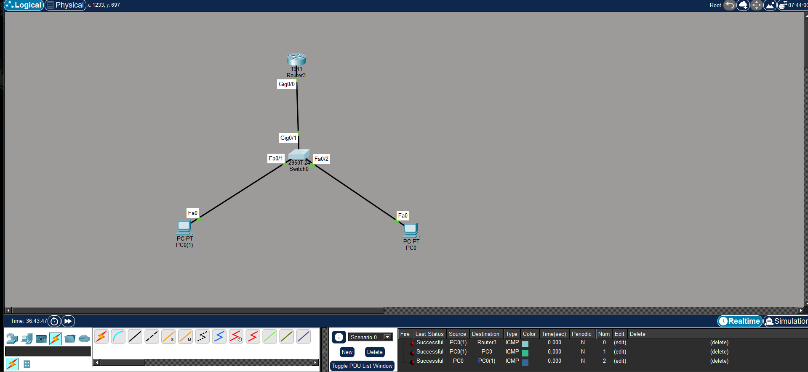

# Cisco Packet Tracer Telnet Lab

## Overview
This project shows a simple Cisco Packet Tracer topology with one router, one switch, and two PCs.  
The lab was used to practice basic device configuration and Telnet remote access.

## Topology
- 1 x Cisco 1941 Router
- 1 x Cisco 2950 Switch
- 2 x PCs



## Features Configured
- Hostname configuration
- Console password
- VTY password
- Enable secret
- Password encryption
- Disable DNS lookup
- Banner message
- IP addressing
- Telnet access
- Saved configurations

## IP Addressing

| Device | Interface | IP Address | Default Gateway |
|---|---|---|---|
| Router R1 | GigabitEthernet0/0 | 10.1.1.254/24 | - |
| Switch S1 | VLAN1 | 10.1.1.253/24 | 10.1.1.254 |
| PC0 | FastEthernet0 | 10.1.1.10/24 | 10.1.1.254 |
| PC1 | FastEthernet0 | 10.1.1.11/24 | 10.1.1.254 |

## Files

```text
telnet-router-switch.pkt
topology.png
Configs/
├── router-config.txt
└── switch-config.txt

screenshots/
├── telnet-router.png
└── telnet-switch.png
```

## Telnet Verification

### Router Telnet

PC successfully connected to router using Telnet.


### Switch Telnet

PC successfully connected to switch using Telnet.


## Router Configuration Highlights

- Configured GigabitEthernet0/0 IP address
- Configured console and VTY passwords
- Configured enable secret
- Enabled Telnet access
- Saved running configuration

## Switch Configuration Highlights

- Configured VLAN1 management IP
- Configured default gateway
- Configured console and VTY passwords
- Enabled Telnet access
- Configured MOTD banner

## Commands Used

### Router

```bash
enable
configure terminal
hostname R1
interface gigabitethernet0/0
ip address 10.1.1.254 255.255.255.0
no shutdown
```

### Switch

```bash
enable
configure terminal
hostname S1
interface vlan 1
ip address 10.1.1.253 255.255.255.0
no shutdown
ip default-gateway 10.1.1.254
```

## Telnet Commands

```bash
telnet 10.1.1.254
telnet 10.1.1.253
```

## Notes

- `service password-encryption` was used to encrypt passwords.
- `no ip domain-lookup` was configured to prevent unwanted DNS lookup.
- Telnet connectivity was verified successfully from PCs.
